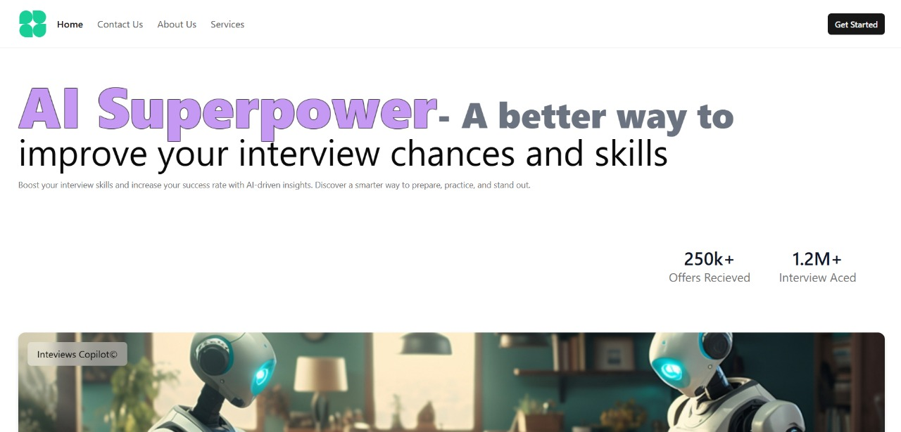
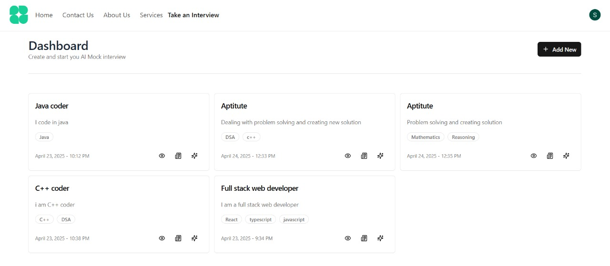
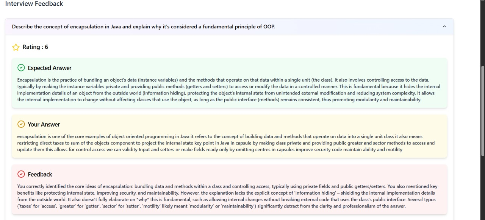
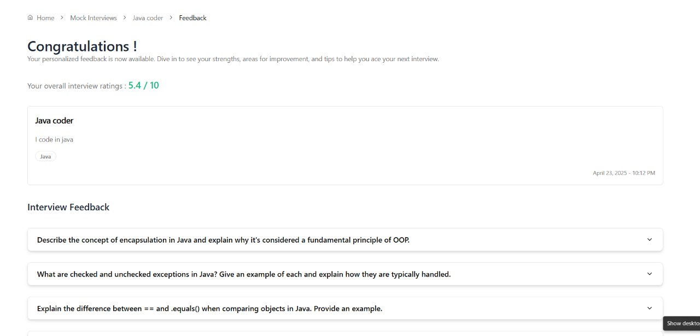

# AI Mock Interview Application

An AI-powered mock interview platform that helps students and early-career engineers practice technical interviews with real-time questions, structured feedback, and performance insights.

Built to simulate realistic interview scenarios and highlight gaps in conceptual understanding, communication, and problem-solving.

---

## 🚀 Features

- Role-specific mock interviews (e.g., Software Engineer, Full Stack Developer)
- AI-generated technical questions (Java, CS fundamentals, system thinking)
- Automated evaluation with detailed feedback and scoring
- Webcam-enabled interview experience
- Structured interview flow: setup → interview → feedback
- Clean, responsive UI

---

## 🛠️ Tech Stack

- **Frontend:** React + TypeScript
- **Build Tool:** Vite
- **Styling:** Modern CSS / utility-based styling
- **AI Integration:** LLM-based question generation and evaluation
- **Web APIs:** Webcam access, form handling

---

## 📸 Screenshots

### Landing & Interview Setup
<p float="left">
  
</p>

### Interview Experience
<p float="left">
  
  
</p>

### AI Feedback & Evaluation
<p align="center">
  
</p>

---

## 🧠 How It Works

1. User selects a job role and provides basic requirements  
2. AI generates role-appropriate interview questions  
3. User answers questions in a simulated interview environment  
4. System evaluates responses and provides structured feedback  
5. User receives actionable insights on strengths and weaknesses  

---

## ▶️ Running Locally

```bash
npm install
npm run dev

